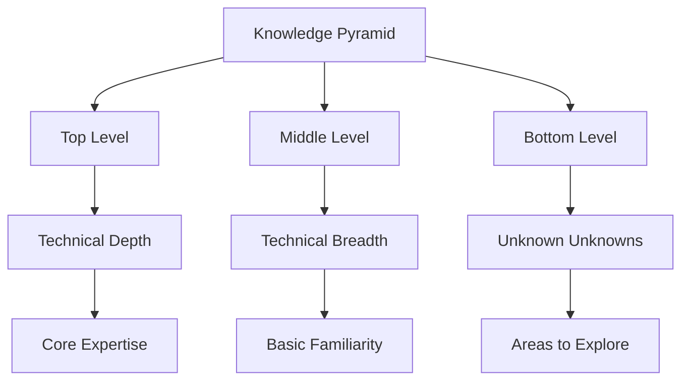
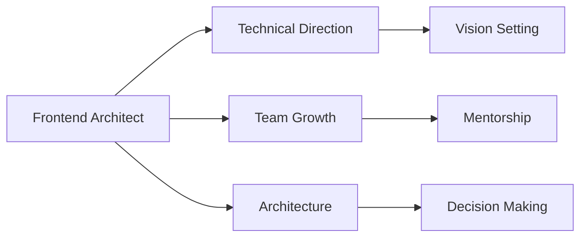

# 📚 The Frontend Architect Role 🎨

## 🧠 Overview

The role of a frontend architect is not universally defined, but modern architects share common responsibilities and traits. Unlike traditional "ivory tower" architects who worked in isolation, modern architects are embedded within development teams, acting as both technical leaders and team collaborators.

> 💭 **Thought Bubble:** Think of a frontend architect as a city planner who also knows how to build houses - they need both the big-picture vision and hands-on experience to guide the team effectively.

## 🚀 Key Concepts and Takeaways

- **Modern Architect** 🏗️

  - Embedded in development teams
  - Hands-on technical leadership
  - Collaborative approach
  - Like a lead architect who also knows construction

- **Technical Balance** ⚖️

  - Deep expertise in core technologies
  - Broad understanding of related areas
  - Continuous learning mindset
  - Like a master builder who understands multiple trades

- **Leadership Qualities** 👥
  - Mentorship and team growth
  - Documentation and knowledge sharing
  - Cross-team collaboration
  - Like a team captain who helps everyone improve

## 📝 Detailed Notes

### Key Responsibilities 🎯

#### 1. Setting Technical Direction 🧭

- Creating and maintaining technical vision
- Making architectural decisions
- Writing and reviewing code
- Speaking on behalf of technologies
- Ensuring team alignment
- Like setting the master plan for a city

#### 2. Applying Architectural Thinking 🤔

- Understanding tradeoffs
- Translating business needs to technical requirements
- Maintaining technical breadth and depth
- Making informed decisions
- Like balancing different city needs (residential, commercial, etc.)

#### 3. Performing "Glue Work" 🔗

- Writing documentation
- Running meetings
- Providing mentorship
- Growing the team
- Sharing knowledge
- Facilitating collaboration
- Like the infrastructure that connects different parts of a city

### The Knowledge Pyramid 📚



1. **Top Level (Technical Depth)** 🎯

   - Areas of expertise (React, JavaScript)
   - Deep, specialized knowledge
   - Like mastering a specific building technique

2. **Middle Level (Technical Breadth)** 🌐

   - Surface-level understanding
   - Areas of basic familiarity
   - Things "we know we don't know"
   - Like understanding different construction methods

3. **Bottom Level** 🔍
   - Unknown unknowns
   - Areas requiring exploration
   - Like discovering new building materials

## 💡 Examples

### Technical Leadership in Action 🎯



- Setting up architectural reviews
- Creating technical documentation
- Leading knowledge sharing sessions
- Like organizing a construction team

### Knowledge Sharing Example 📚

```js
// Example of architectural documentation
/**
 * @architecture Decision
 * @context Frontend State Management
 * @decision Use React Context for global state
 * @rationale
 * - Simple to implement
 * - Built into React
 * - Good for medium-sized apps
 * @alternatives
 * - Redux (more complex)
 * - Zustand (lighter weight)
 * @consequences
 * - Easy to get started
 * - May need to refactor for larger apps
 */
const AppStateContext = createContext();
```

## 📊 Visual Aids

| Role Aspect          | Traditional Architect 🏛️ | Modern Architect 🏗️           |
| -------------------- | ------------------------ | ----------------------------- |
| **Location**         | Ivory Tower              | Embedded in Team              |
| **Focus**            | Pure Architecture        | Architecture + Implementation |
| **Communication**    | Top-down                 | Collaborative                 |
| **Documentation**    | Formal                   | Practical + Formal            |
| **Code Involvement** | Minimal                  | Active                        |

## 📚 References & Further Reading

- 📖 [Staff Engineer](https://www.oreilly.com/library/view/staff-engineer/9781098118723/) by Will Larson
- 📖 [Technical Leadership and Glue Work](https://www.youtube.com/watch?v=KClAPipnKqw) by Tanya Reilly
- 📖 [Being Glue](https://noidea.dog/glue) by Tanya Reilly
- 📖 [Go Deep, Then Go Broad](https://maxiferreira.com/go-deep-then-go-broad/) by Maxi Ferreira

## 📝 Notes & Annotations

- 🔍 Modern architects are embedded in teams, not isolated
- 💡 Success requires both technical depth and breadth
- 🎯 "Glue work" is crucial for team success
- 📊 Architecture is a shared responsibility
- ⚠️ Common Pitfall: Focusing too much on technical depth at the expense of team growth
- 💪 Pro Tip: Document architectural decisions as you make them
- 🎨 Visual Tip: Use knowledge maps to track your expertise areas
- 🔄 Revision Note: Review your knowledge pyramid quarterly
