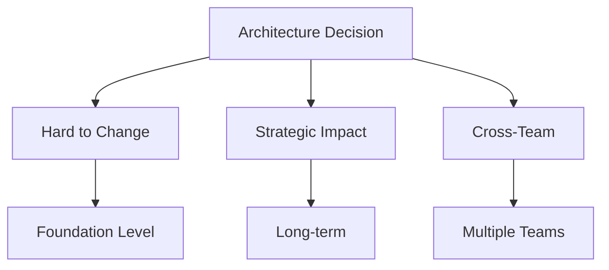
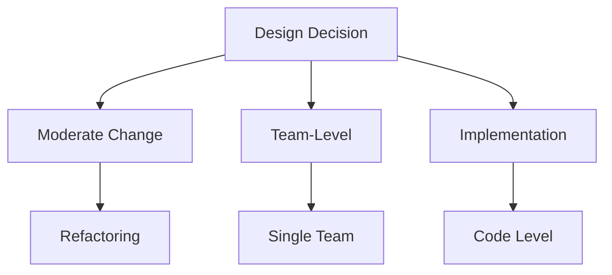

# 📚 System Design vs Architecture 🎯

## 🧠 Overview

While the terms "architecture" and "design" are often used interchangeably, there are important distinctions between them that can be viewed as a spectrum. Understanding this spectrum helps in making better technical decisions and allocating appropriate resources.

> 💭 **Thought Bubble:** Think of architecture and design as a spectrum from city planning (architecture) to interior design (implementation details) - both are important but serve different purposes and require different levels of consideration.

## 🚀 Key Concepts and Takeaways

- **Architecture End** 🏗️

  - Focuses on system structure
  - High-level decisions
  - Strategic implications
  - Cross-team impact
  - Like city planning and zoning laws

- **Design End** 🎨
  - Focuses on code implementation
  - Design patterns
  - Function naming
  - Code organization
  - Day-to-day operations
  - Like interior design and room layout

## 📝 Detailed Notes

### Decision Analysis Framework 🔍

To determine where a decision falls on the spectrum, consider:

#### 1. Change Difficulty ⚖️

- **Architecture** 🏗️

  - Harder to change
  - Like moving a building's foundation
  - Requires significant planning and coordination

- **Design** 🎨
  - Easier to change
  - Like rearranging furniture
  - Can be done with minimal disruption

#### 2. Strategic vs Tactical Nature 🎯

- **Architecture** 🏗️

  - Involves multiple teams
  - Long-term implications
  - Strategic thinking required
  - Like city infrastructure planning

- **Design** 🎨
  - Day-to-day operations
  - Immediate team focus
  - Tactical implementation
  - Like choosing paint colors

#### 3. Context Requirements 📚

- **Architecture** 🏗️

  - High-level context needed
  - Understanding of entire system
  - Cross-application knowledge
  - Like understanding city-wide impact

- **Design** 🎨
  - Code-level context
  - Constrained to specific codebase
  - Like understanding room dimensions

## 💡 Examples

### Architecture Decision Example 🏗️

**Micro-frontends vs Monolithic SPA**

- Hard to change
- Strategic (involves entire team)
- High-level (requires understanding of performance, reliability, quality attributes)
- Like choosing between a shopping mall or individual stores

### Design Decision Example 🎨

**State Management with Signals**

- Moderate difficulty to change
- Somewhat strategic
- More code-focused
- Falls in middle of spectrum
- Like choosing between different furniture arrangements

## 📊 Visual Aids

| Decision Aspect       | Architecture 🏗️ | Design 🎨        |
| --------------------- | --------------- | ---------------- |
| **Change Difficulty** | Hard            | Easy             |
| **Scope**             | System-wide     | Code-level       |
| **Impact**            | Long-term       | Short-term       |
| **Stakeholders**      | Multiple teams  | Development team |
| **Documentation**     | Thorough        | Light            |

## 📚 References & Further Reading

- 📖 [Software Architecture in Practice](https://www.oreilly.com/library/view/software-architecture-in/9780136886099/) by Len Bass et al.
- 📖 [Clean Architecture](https://www.oreilly.com/library/view/clean-architecture-a/9780134494272/) by Robert C. Martin
- 📖 [Design Patterns](https://www.oreilly.com/library/view/design-patterns-elements/0201633612/) by Gang of Four

## 📝 Notes & Annotations

- 🔍 Understanding the spectrum helps allocate appropriate time and resources
- 💡 Architecture decisions require broader stakeholder involvement
- 🎯 Design decisions can often be made more quickly
- 📊 Document architecture decisions thoroughly
- ⚠️ Common Pitfall: Treating architectural decisions as design decisions
- 💪 Pro Tip: Use the spectrum framework to guide decision-making processes
- 🎨 Visual Tip: Create decision matrices for complex architectural choices
- 🔄 Revision Note: Review architecture decisions quarterly
