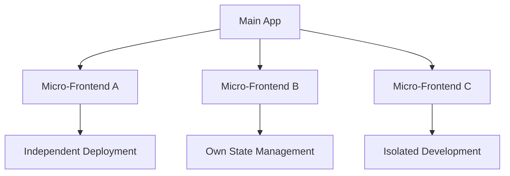
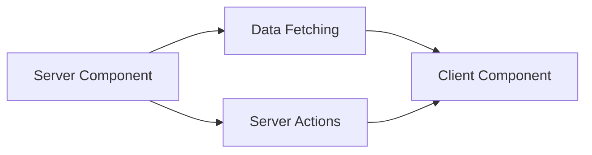

# 📚 What is Frontend Architecture? 🎨

## 🧠 Overview

Frontend architecture is the discipline of designing and organizing the client-side of web applications, focusing on the structure, components, and interactions that create the user experience. It represents a set of decisions about how we organize our frontend layer to promote higher quality attributes.

> 💭 **Thought Bubble:** Think of frontend architecture as the art of organizing a digital city's user interface - where every component, like buildings in a city, needs to work together harmoniously while maintaining its own identity.

## 🚀 Key Concepts and Takeaways

- **Core Definition** 🎯

  - "The important frontend stuff" that determines system organization
  - Like a city's urban planning for the digital world
  - Focuses on user experience and interface organization

- **Spectrum Approach** 🌈

  - Traditional frontend-backend separation has evolved
  - Various hybrid approaches available
  - Like a city that blends residential and commercial areas

- **Four Dimensions** 📐
  - Architectural Style
  - Quality Attributes
  - Architectural Decisions
  - Building Blocks

## 📝 Detailed Notes

### Frontend-Backend Spectrum 🔄

- **Frontend Side** 🎨

  - HTML (structure)
  - CSS (presentation)
  - Client-side JavaScript (behavior)
  - Like the visible parts of a city

- **Middle Ground** 🤝

  - Modern frameworks (Next.js, Nuxt)
  - React Server Components
  - Hybrid approaches
  - Like mixed-use developments

- **Backend Side** ⚙️
  - Databases
  - APIs
  - Infrastructure (e.g., Kubernetes)
  - Like city utilities and services

### Architecture Dimensions Analysis 📊

- **Style** 🎨

  - Defines the overall approach
  - Examples:
    - Micro-Frontends (like city districts)
    - Monolithic (like a single large building)
    - Server Components (like a building with shared services)

- **Quality Attributes** ⭐

  - Performance 🚀
  - Scalability 📈
  - Maintainability 🔧
  - Deployability 🚢
  - Reliability 🔒

- **Architectural Decisions** 📋

  - Implementation rules and patterns
  - State management approaches
  - Component communication
  - Like city planning regulations

- **Building Blocks** 🧩
  - Components
  - Hooks
  - Services
  - Like the basic units of a city

## 💡 Examples

### Micro-Frontends Architecture 🏗️

**Explanation:** Demonstrates a distributed approach with independent deployable units, focusing on scalability and maintainability.



```js
// Example of micro-frontend composition
const App = () => (
  <div className="city-layout">
    <Header district="navigation" />
    <MicroFrontendA district="shopping" />
    <MicroFrontendB district="entertainment" />
  </div>
);
```

### Monolithic React Server Components 🏢

**Explanation:** Shows a unified approach with server-side rendering capabilities, emphasizing performance and reliability.



```js
// Example of server component
async function CityBlock({ district }) {
  const data = await fetchDistrictData(district);
  return (
    <ClientComponent
      data={data}
      onUpdate={async (updates) => {
        await updateDistrictData(district, updates);
      }}
    />
  );
}
```

## 📊 Visual Aids

| Architecture Dimension         | Example 1: Micro-Frontends                                                          | Example 2: Monolithic React Server Components                       |
| ------------------------------ | ----------------------------------------------------------------------------------- | ------------------------------------------------------------------- |
| **Style** 🎨                   | Micro-Frontends                                                                     | Monolithic React Server Components                                  |
| **Quality Attributes** ⭐      | • Scalability<br>• Deployability<br>• Maintainability                               | • Performance<br>• Agility<br>• Reliability                         |
| **Architectural Decisions** 📋 | • Global state sharing with signals<br>• Client-side composition of micro-frontends | • State sharing with store<br>• Data mutation using server actions  |
| **Building Blocks** 🧩         | • Models<br>• Collections<br>• Views<br>• Templates<br>• Classes                    | • Client components<br>• Server components<br>• Hooks<br>• Services |

## 📚 References & Further Reading

- 📖 [Micro Frontends](https://martinfowler.com/articles/micro-frontends.html) by Cam Jackson
- 📖 [React Server Components](https://react.dev/blog/2023/03/22/react-labs-what-we-have-been-working-on-march-2023)
- 📖 [Next.js Documentation](https://nextjs.org/docs)
- 📖 [Frontend Architecture for Design Systems](https://www.oreilly.com/library/view/frontend-architecture-for/9781491929772/)

## 📝 Notes & Annotations

- 🔍 The same application can be built using different architectures that may look identical to end users
- 💡 Architecture choice depends on team size, project requirements, and desired quality attributes
- 🎯 Modern frameworks are blurring the traditional frontend-backend separation
- 📊 The four dimensions framework helps in making informed architectural decisions
- ⚠️ Common Pitfall: Over-engineering simple applications
- 💪 Pro Tip: Start with the simplest architecture that works and evolve as needed
- 🎨 Visual Tip: Use component diagrams to communicate frontend architecture
- 🔄 Revision Note: Review architecture decisions when adding new features
