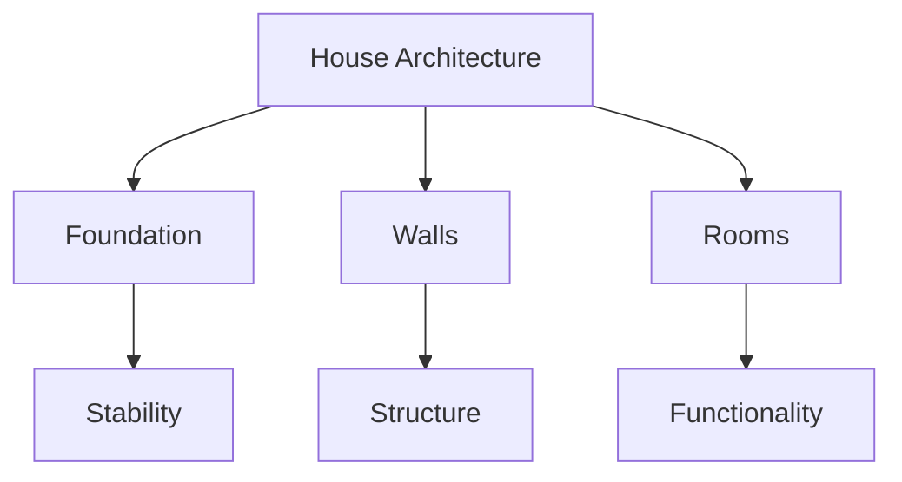
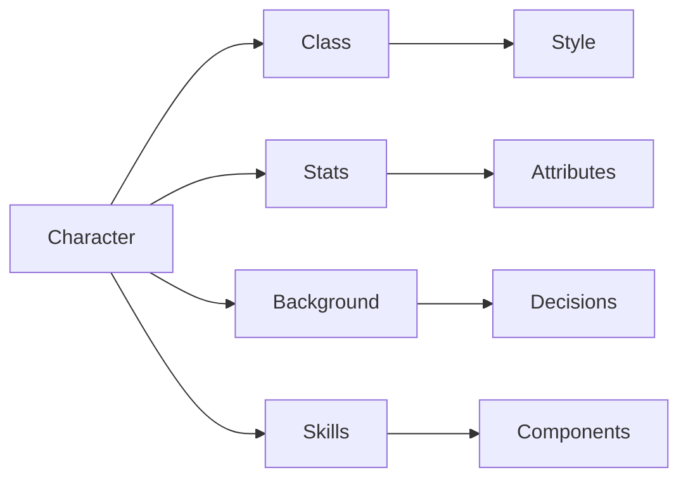

# 📚 What is Software Architecture? 🏗️

## 🧠 Overview

Software Architecture is the set of significant design decisions about how a system is organized to promote desired quality attributes and other properties. It's similar to how a house has a foundation, walls, and rooms - it defines the underlying structure for all software components and provides the framework on which they are built.

> 💭 **Thought Bubble:** Think of architecture as the blueprint that guides how all the pieces fit together, just like a city planner designs how buildings, roads, and parks interact.

## 🚀 Key Concepts and Takeaways

- **Architecture as Decisions** 🎯

  - "Decisions you wish you could get right early in a project"
  - Significant, hard to change, and impact system organization
  - Like choosing the foundation of a building - hard to change later!

- **Four Dimensions** 📐

  - Architectural Style (overall structure)
  - Characteristics (quality attributes)
  - Architectural Decisions (implementation rules)
  - Logical Components (building blocks)

- **Trade-offs** ⚖️
  - Cannot optimize all characteristics simultaneously
  - Must prioritize based on system requirements
  - Like a video game character - can't max out all stats!

## 📝 Detailed Notes

### Evolution of Architecture Definitions 🔄

1. **Initial Focus** 🏛️

   - System structure (similar to physical architecture)
   - Like building a house with just walls and rooms

2. **Decision-Based** 🤔

   - Emphasis on early architectural decisions
   - "What decisions will we regret if we get wrong?"

3. **"Important Stuff"** ⭐

   - Raises questions about significance
   - What truly matters in our system?

4. **Comprehensive** 🌟
   - Combines all previous aspects
   - Holistic view of architecture

### Architectural Style 🎨

- **Definition:** Overall structure and pattern
- **Examples:**
  - Microservices (like a city of independent buildings)
  - Layered (like a cake with distinct layers)
  - Monolithic (like a single, large building)
  - Event-driven (like a network of messengers)

### Characteristics (Quality Attributes) 📊

- **System Properties:**
  - Performance 🚀
  - Scalability 📈
  - Reliability 🔒
  - Deployability 🚢
  - Agility 🏃

### Architectural Decisions 📋

- **Rules and Guidelines:**
  - Service communication protocols
  - Database choices
  - Message protocols
  - Like a city's building codes

### Logical Components 🧩

- **Building Blocks:**
  - Modules
  - UI components
  - Classes
  - Functions
  - Design systems

## 💡 Examples

### House Architecture Analogy 🏠

**Explanation:** Demonstrates how software architecture provides the foundational structure for all components, similar to how a house's architecture defines its rooms and layout.

### Video Game Character Analogy 🎮

**Explanation:** Shows how the four dimensions of architecture map to character attributes, making the concept more relatable and easier to understand.

## 📚 References & Further Reading

- 📖 _Original Source:_ [Who Needs an Architect?](https://martinfowler.com/ieeeSoftware/whoNeedsArchitect.pdf) by Martin Fowler
- 📖 [Design It!](https://pragprog.com/titles/mkdsa/design-it/) by Michael Keeling
- 📖 [Head First Software Architecture](https://www.oreilly.com/library/view/head-first-software/9781492087997/) by Raju Gandhi, Mark Richards, Neal Ford

## 📝 Notes & Annotations

- 📝 The four dimensions framework is particularly useful for analyzing existing systems
- 🔍 The game character analogy makes complex architectural concepts more accessible
- 💡 Understanding trade-offs between different quality attributes is crucial for making good architectural decisions
- 🎯 Early architectural decisions have long-lasting impacts on system evolution
- ⚠️ Common Pitfall: Trying to optimize all quality attributes simultaneously
- 💪 Pro Tip: Document architectural decisions and their rationale
- 🎨 Visual Tip: Use diagrams to communicate architectural concepts
- 🔄 Revision Note: Review this section when starting a new project
