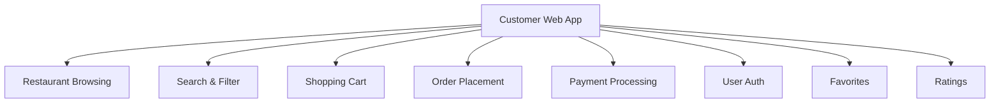

# 📚 Project Introduction: FullSnack 🍔

## 🧠 Overview

FullSnack is a food delivery web application (similar to Uber Eats) that serves as our case study throughout the course. The project is based on a real-world application to provide practical context and examples for understanding frontend architecture.

> 💭 **Thought Bubble:** Think of FullSnack as a digital restaurant city - where customers, restaurants, and drivers interact through a well-designed interface, much like how a well-planned city facilitates smooth interactions between its residents and services.

## 🚀 Key Concepts and Takeaways

- **Project Purpose** 🎯

  - Illustrate architectural concepts and techniques
  - Provide practical examples for exercises
  - Demonstrate real-world application of architectural principles
  - Serve as a reference for feature implementation

- **Project Scale** 📈
  - Team Size: 4 frontend engineers (expected to triple in 12 months)
  - Complex system with multiple user types
  - Integration with external systems
  - Real-time features and requirements

## 📝 Detailed Notes

### System Context 🌐

#### System Users 👥

1. **Customer** 🛍️

   - Purchases food through the app
   - Uses the Customer Web App
   - Like a restaurant patron in a digital food court

2. **Restaurant** 🏪

   - Restaurant owners and employees
   - Manages incoming orders
   - Updates menu options
   - Like a physical restaurant with digital management

3. **Driver** 🚗
   - Delivery personnel
   - Collects and delivers orders
   - Like a courier service for food

#### External Systems 🔌

1. **Third-party Payment System** 💳

   - Manages payments and refunds
   - Handles credit card information
   - Example: Stripe
   - Like a digital cashier system

2. **FullSnack Admin System** 👨‍💼
   - Managed by a different team
   - Separate from the main system
   - Different purpose and scope
   - Like a back-office management system

### System Components 🏗️

#### Core Applications 📱

1. **Customer Web App** 🖥️

   - Web application for customers
   - Used for browsing and ordering food
   - Our primary focus for architecture design
   - Like the main shopping interface

2. **Restaurant Web App** 🏪

   - React SPA
   - Order management
   - Menu updates
   - Like a restaurant's order management system

3. **Driver Mobile App** 📱
   - Native iOS and Android
   - Order collection and delivery
   - Like a delivery driver's navigation system

#### Backend Services ⚙️

1. **Core API** 🔌

   - Java Spring Boot
   - REST API
   - Gateway to external systems
   - Manages customer data, orders, and menu items
   - Like the central nervous system

2. **Core Database** 💾

   - MySQL
   - Main data store
   - Accessed by Core API
   - Like the system's memory

3. **WebSockets Server** 🔄
   - Socket.io
   - Real-time event communication
   - Order status updates
   - Driver location tracking
   - Like the system's real-time messaging system

## 💡 Examples

### Customer Web App Features 🛍️

- Restaurant and food browsing
- Search and filtering
- Shopping cart functionality
- Order placement and tracking
- Payment processing
- User authentication
- Favorites and recommendations
- Ratings and reviews

## 📊 Visual Aids

| System Component     | Technology Stack 🛠️ | Purpose 🎯          |
| -------------------- | ------------------- | ------------------- |
| **Customer Web App** | React, TypeScript   | Ordering & Browsing |
| **Restaurant App**   | React SPA           | Order Management    |
| **Driver App**       | Native iOS/Android  | Delivery            |
| **Core API**         | Java Spring Boot    | Backend Services    |
| **Database**         | MySQL               | Data Storage        |
| **WebSockets**       | Socket.io           | Real-time Updates   |

## 📚 References & Further Reading

- 📖 [Project Specification](https://github.com/Charca/frontend-architecture-workshop/blob/main/documents/project-spec.md)
- 📖 [Spring Boot Documentation](https://spring.io/projects/spring-boot)
- 📖 [Socket.io Documentation](https://socket.io/docs/v4/)
- 📖 [MySQL Documentation](https://dev.mysql.com/doc/)

## 📝 Notes & Annotations

- 🔍 The project serves as a practical example of real-world frontend architecture
- 💡 Consider scalability requirements from the start
- 🎯 Focus on the Customer Web App for architecture design
- 📊 Real-time features require careful architectural consideration
- ⚠️ Common Pitfall: Underestimating the complexity of real-time features
- 💪 Pro Tip: Document all integration points with external systems
- 🎨 Visual Tip: Create system architecture diagrams early
- 🔄 Revision Note: Review scalability requirements quarterly
